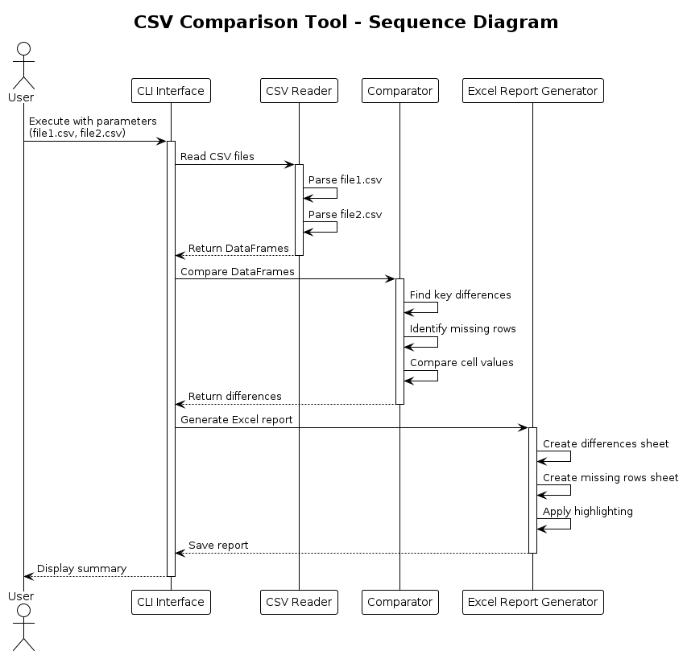
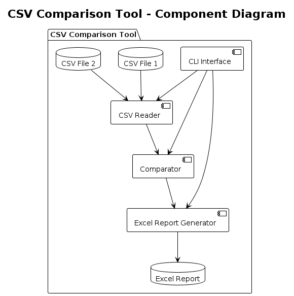

# CSV Comparison Tool

A Python-based tool for comparing two CSV files and generating detailed Excel reports highlighting the differences. This tool is particularly useful for data analysis, quality assurance, and verification tasks where you need to identify discrepancies between two CSV datasets.

## Features

- Compares two CSV files using a specified key column (defaults to `some_id_column`)
- Generates an Excel report with highlighted differences (background color yellow)
- Identifies rows present in only one file
- Supports ignoring specific columns during comparison
- Highlights differences with yellow background in the Excel output
- Provides detailed console output of differences and missing rows

## Requirements

```
python >= 3.6
openpyxl
```

## Installation

1. Clone this repository:
```bash
git clone [your-repo-url]
cd [repository-name]
```

2. Install the required dependencies:
```bash
pip install openpyxl
```

## Usage

Basic usage:
```bash
python main.py file1.csv file2.csv
```

With optional parameters:
```bash
python main.py file1.csv file2.csv --key-column id_column --ignore column1 column2 --output results.xlsx
```

### Arguments

- `file1`: Path to the first CSV file
- `file2`: Path to the second CSV file
- `--key-column`: (Optional) Column to use as key for comparison (default: some_id_column)
- `--ignore`: (Optional) Space-separated list of column names to ignore in comparison
- `--output`: (Optional) Output Excel file path (default: comparison_results.xlsx)

## Output

The tool generates:

1. An Excel file containing:
   - "Differences" sheet: Shows pairs of rows with differences highlighted in yellow
   - "Missing Rows" sheet: Lists rows unique to each file

2. Console output showing:
   - Different headers between files (if any)
   - Number and keys of rows present in only one file
   - Detailed differences in matching rows

## Example

```bash
python main.py original.csv updated.csv --key-column some_id_column --ignore timestamp modified_by --output comparison.xlsx
```

## Notes

- The CSV files must contain the specified key column (defaults to `some_id_column`) which is used as the key for comparison
- The tool handles different column orders between files
- Empty cells are considered valid values for comparison
- Large files might require significant memory depending on their size

## Sequence Diagram



## Components Diagram



## License

Copyright 2025 Hannes Geist - Freier Softwareentwickler

Permission is hereby granted, free of charge, to any person obtaining a copy of this software and associated documentation files (the "Software"), to deal in the Software without restriction, including without limitation the rights to use, copy, modify, merge, publish, distribute, sublicense, and/or sell copies of the Software, and to permit persons to whom the Software is furnished to do so, subject to the following conditions:

The above copyright notice and this permission notice shall be included in all copies or substantial portions of the Software.

THE SOFTWARE IS PROVIDED "AS IS", WITHOUT WARRANTY OF ANY KIND, EXPRESS OR IMPLIED, INCLUDING BUT NOT LIMITED TO THE WARRANTIES OF MERCHANTABILITY, FITNESS FOR A PARTICULAR PURPOSE AND NONINFRINGEMENT. IN NO EVENT SHALL THE AUTHORS OR COPYRIGHT HOLDERS BE LIABLE FOR ANY CLAIM, DAMAGES OR OTHER LIABILITY, WHETHER IN AN ACTION OF CONTRACT, TORT OR OTHERWISE, ARISING FROM, OUT OF OR IN CONNECTION WITH THE SOFTWARE OR THE USE OR OTHER DEALINGS IN THE SOFTWARE.

## Contributing

Contributions are welcome! Please feel free to submit a Pull Request. 